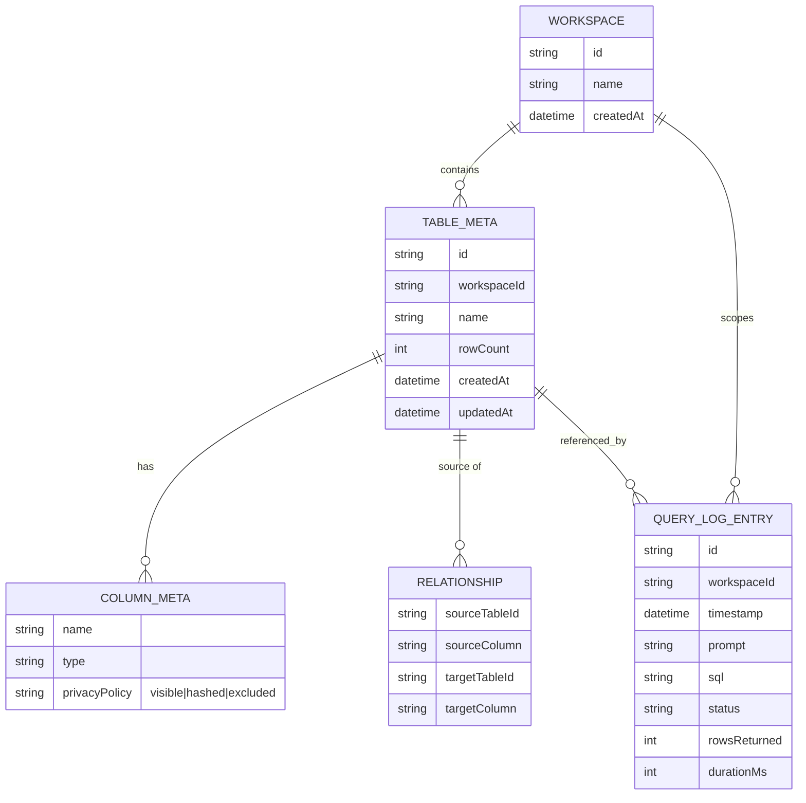

# DashDraft — Functional Requirements Document (FRD)

**Status:** Draft v1
**Depends on:** `docs/technical-architecture.md` (tech stack, security model, relay design), `.agents/skills/design-system/` (visual system)
**Not covered here:** visual copy/content for the landing page, final logo/wordmark, analytics feature scope (explicitly future)

---

## 1. Document Purpose

Defines *what* DashDraft does, screen by screen and flow by flow, building on the *how it's built* decisions already made in the architecture doc. Each requirement below has an ID (`FR-#`) for traceability back to your original feature list (mapped in §11).

---

## 2. Personas & Core User Story

**Primary persona:** a technical-enough user (analyst, founder, PM) who has a CSV/Excel dataset and wants to ask it questions from inside ChatGPT or Gemini, without pasting the data in or paying for the tokens a full-file upload would cost.

**Core story:** *"I drop my sales CSV into DashDraft, wire it up to ChatGPT once, and from then on I just ask ChatGPT questions about my sales data — the raw rows never leave my machine, and no random SELECT * dump ever ends up in a chat transcript."*

---

## 3. Information Architecture

```
/                          Landing page (public, no auth)
/{userId}                  Dashboard (default tab: Tables)
/{userId}?tab=tables       Tables view (default)
/{userId}?tab=analytics    Analytics (upcoming — disabled state)
/{userId}?tab=settings     Settings
```

- `{userId}` is a routing identifier, generated client-side and persisted to `localStorage` — **it is not a security credential.** Anyone who opens the URL without the matching browser's `localStorage` entry *and* without local-folder access sees an empty/onboarding shell, not data. This distinction should be stated in the landing page copy and in Settings, so users don't mistake URL secrecy for actual access control.
- Sidebar has exactly three entries, per spec: **Analytics** (upcoming, visually disabled with a "Soon" badge), **Tables** (primary workspace), **Settings** (pinned to the bottom of the sidebar, visually separated from the other two).

---

## 4. Feature Requirements

### FR-1 — Landing Page

**Goal:** explain the product and get the user into the dashboard with zero friction.

- Hero section: one-sentence value proposition + primary CTA (see FR-2).
- Architecture diagram: a simplified, non-technical version of the browser → relay → AI-platform flow (three boxes: "Your browser," "DashDraft relay," "ChatGPT / Gemini" — plain-language captions, not the full mermaid diagram from the architecture doc, which is written for engineers).
- Step-by-step implementation guide, numbered, matching the onboarding checklist order (FR-4): choose a folder → generate connector credentials → connect to ChatGPT/Gemini → upload your first file → ask your first question.
- Each step has a **GIF placeholder slot** — a fixed-aspect-ratio container with alt text describing the intended content (e.g., `alt="GIF: selecting a local folder via the browser's folder picker"`). Actual GIF assets are a content/production task, out of scope for the agent to generate — the component should render a static placeholder frame (using a design-system token background + a "Preview coming soon" label) until a real asset is dropped in.
- Secondary CTA: link to the query-safety explanation (why SELECT * is blocked, why data stays local) — this is the tool's actual differentiator and deserves its own scannable section, not just a footnote.

### FR-2 — CTA → Dynamic Dashboard Link

- Primary CTA button label: "Open Dashboard" (or similar — copy TBD).
- On click:
  1. Check `localStorage` for an existing `dashdraft_user_id`.
  2. If present, navigate to `DOMAIN/{existingUserId}`.
  3. If absent, generate a new ID (see FR-3 for format), write it to `localStorage`, then navigate to `DOMAIN/{newUserId}`.
- This means the CTA is idempotent per browser — clicking it a second time on the same browser returns the user to the same dashboard, not a fresh one.

### FR-3 — Persistent User ID

- ID format: URL-safe, collision-resistant, no personally identifying structure — a `nanoid` (21 chars, URL-safe alphabet) is a reasonable default over a full UUID for a shorter, cleaner URL.
- Stored under a namespaced key, e.g. `dashdraft_user_id`, not a generic `userId` key that could collide with other tools.
- This ID is **also** written into the local config file (FR-13) the first time a folder is chosen, so it survives a `localStorage` clear as long as the user still has folder access (see FR-17 for the reconciliation flow when the two disagree).

### FR-4 — Onboarding Checklist (Dashboard Home)

A progress indicator shown at the top of the Tables view until all steps are complete, then collapsed into a small dismissible/reopenable summary (not deleted — a returning user should be able to re-expand it, e.g. to reconnect MCP after a credential regeneration).

Steps, in order:

1. **Choose local folder to store data** — complete when a folder handle has been granted via the File System Access API.
2. **Generate OAuth key & secret** — complete when `oauth.clientId`/`oauth.clientSecret` exist in the local config file.
3. **Connect MCP with Gemini or ChatGPT** — complete when the relay records a successful authenticated handshake (tools-list call) against this user's credentials. This is an event we can only observe reactively — the checklist item flips to complete the first time such a handshake is confirmed, not when the user merely clicks "I've connected it."
4. **Upload first CSV/TSV/Excel file** — complete when at least one table exists.
5. **First prompting** — complete when at least one query-log entry exists (i.e., the AI platform successfully executed a query, distinct from step 3's handshake-only event).

**Derivation rule:** steps 1, 2, 4, and 5 are derived live from actual state (folder handle, config contents, table count, log count) rather than stored as separate boolean flags — this avoids the checklist ever showing "done" for something that's actually missing. Step 3 is the one exception and needs an explicit stored flag, since a successful handshake isn't otherwise observable from local state alone.

### FR-5 — File Upload & Conversion (CSV / TSV / Excel)

- Accepted formats: `.csv`, `.tsv`, `.xlsx`, `.xls`.
- CSV/TSV parsed via streaming parse (see performance rule in the agent kit); Excel parsed via a sheet-reading library, with **multi-sheet workbooks prompting the user to choose which sheet(s) become table(s)** — one table per selected sheet, not an automatic merge.
- Before committing, show a **schema preview**: detected column names, inferred types (text/number/date/boolean), and a sample of the first ~10 rows — the user can adjust an inferred type before the table is created, since automatic type inference on messy real-world data will sometimes guess wrong.
- Table name defaults to the file/sheet name (sanitized to a valid SQL identifier), editable before commit.

### FR-6 — Rename Table / Columns

- Inline rename UI on both table name and individual column headers.
- Underlying implementation: `ALTER TABLE ... RENAME TO`, `ALTER TABLE ... RENAME COLUMN` (both supported by the SQLite version sql.js bundles).
- Renaming a column must cascade to: any FK relationship referencing it (FR-9), any column privacy policy keyed to it (FR-10). Historical query-log entries (FR-12) are **not** rewritten — they're an immutable record of what was actually run at the time, and should visually reflect the old name if it's since changed.

### FR-7 — Append Rows to an Existing Table via File Upload

- User selects an existing table, then uploads a file intended to add rows to it.
- Before commit, show a diff/preview: how many rows will be added, any columns in the file that don't match the existing schema (offer to either add the new column to the table or ignore/drop it from the incoming file — user's explicit choice, never silent), and any existing columns the file doesn't populate (filled as `NULL` for the new rows).
- This reuses the same cleaning pass as FR-8.

### FR-8 — Auto-Cleaning on Ingest

Default behavior (flagged as an assumption pending product sign-off — see §9):

- Whitespace-only cell values are normalized to `NULL`, not kept as empty strings.
- A row that is **entirely** empty across all columns is dropped, with a summary count shown to the user after import ("12 fully blank rows were skipped").
- A row that is **partially** empty is kept, with the empty cells stored as `NULL` — no silent default-value fill.
- This is a first-pass, non-configurable behavior for v1. Configurable cleaning rules (fill strategies, per-column rules) are a reasonable v2 candidate, not built now.

### FR-9 — Type Conversion & Relationships (Foreign Keys) via UI

- **Type conversion:** a column's type can be changed after creation via the UI (e.g., text → number). The system validates every existing value against the target type first and shows which rows would fail before committing — never a silent truncation or `NULL`-on-failure without telling the user how many rows were affected.
- **Relationships:** a UI flow to declare that Column A in Table 1 references Column B in Table 2.
  - **Implementation note (important):** SQLite does not support adding a foreign-key constraint to an already-existing table without recreating it. Given tables here are frequently altered via the UI (renames, type changes, appends), DashDraft implements relationships as **application-level relationship metadata** (stored alongside table metadata in the local config, not as a DB-level `FOREIGN KEY` constraint). DashDraft uses this metadata to (a) validate relationship integrity on demand rather than on every write, and (b) inform the natural-language-to-SQL generation step so the AI platform's queries can `JOIN` correctly. This is simpler and safer than a recreate-table-on-every-edit approach, at the cost of not getting DB-enforced referential integrity for free — acceptable for a single-user, locally-run tool.

### FR-10 — Column Privacy: Hash or Exclude

Each column has a privacy policy, one of:

- **Visible** (default) — included normally in any query result.
- **Hashed** — the column's value is passed through a deterministic hash (e.g., SHA-256, browser WebCrypto) whenever it appears in a query result. Deterministic (not salted per-query) so that `GROUP BY`/`COUNT DISTINCT`-style questions ("how many unique customer IDs") still work on hashed identifiers without ever exposing the raw value.
- **Excluded** — the column can never appear in any query result. Enforced in two places, defense-in-depth: (1) excluded columns are never included in the schema sent to the AI platform in the first place, so it has no way to reference them, and (2) the query-validation layer (FR-11) rejects any generated query that somehow references an excluded column anyway.

Configured per-column from the table view, with a visible indicator (icon/badge) on hashed and excluded columns so it's obvious at a glance which columns are protected.

### FR-11 — Query Safety Guardrails

Every SQL query generated by the AI platform is validated **client-side, before execution** — this is a hard gate, not a best-effort filter:

- Reject any query using `SELECT *` or `SELECT table.*` — an explicit column list is required.
- Reject any query referencing a column marked **Excluded** (FR-10).
- Enforce a default result row cap (e.g., `LIMIT 200`, configurable) on every query — this isn't in your original list, but it's a direct extension of the tool's core "don't blow up token usage" purpose: an unconstrained query can return a huge result set just as easily as a full-file dump can, so this closes an obvious gap in the guarantee we're making. Flagging it here as a recommendation for product sign-off, not treating it as already agreed.
- A query that fails validation is never executed — it comes back to the AI platform as a structured error explaining which rule it violated, so the model can retry with a corrected query rather than the user seeing a silent failure.

### FR-12 — Query Log

- Every executed query (whether it passed or was rejected by FR-11) is recorded with: timestamp, the natural-language prompt/description that produced it, the generated SQL, status (success/error/rejected), row count returned (if successful), and execution duration.
- Log viewer UI: reverse-chronological list, with bulk-select and bulk-delete.
- Export: selected (or all) entries exportable as a `.txt` file, one entry per block, human-readable (timestamp, prompt, SQL, result summary) — not a raw JSON dump, since the stated purpose is a readable audit trail.
- Log entries persist in the local folder (not just in-memory), so the log survives a page reload — see FR-13 for storage shape.

### FR-13 — Local Config File

On first folder selection, DashDraft writes (and thereafter maintains) a config file at `{folder}/.dashdraft/config.json`:

```json
{
  "customerId": "usr_8fK2mQ...",
  "createdAt": "2026-08-09T12:00:00Z",
  "updatedAt": "2026-08-09T12:00:00Z",
  "oauth": {
    "clientId": "dd_client_...",
    "clientSecret": "ENCRYPTED_BLOB",
    "generatedAt": "2026-08-09T12:00:00Z"
  },
  "preferences": {
    "theme": "system",
    "mcpHandshakeConfirmed": false
  },
  "workspaces": [
    { "id": "default", "name": "Default", "createdAt": "2026-08-09T12:00:00Z" }
  ]
}
```

Query log entries and table metadata are written as separate files under the same `.dashdraft/` directory (e.g. `.dashdraft/query-log.json`, `.dashdraft/tables/<tableId>.json`) rather than one growing monolithic file, to keep writes small and avoid rewriting the whole config on every query.

**Security consideration to flag for product sign-off:** storing `oauth.clientSecret` in a plaintext local file is a meaningfully weaker guarantee than everything else this system does around encryption. Recommend encrypting the secret at rest using a key derived via WebCrypto (e.g., from a user-set local passphrase, or a key held only in an in-memory/session-scoped location and re-entered on return visits) rather than writing it in the clear. This needs a product decision on the UX trade-off (a passphrase adds friction; plaintext-on-disk is a real exposure if the machine or folder — e.g., a synced cloud folder — is compromised).

### FR-14 — Settings: Regenerate OAuth Credentials

- Settings tab includes a "Regenerate connector credentials" action, with a confirmation step that explicitly warns: *this will immediately invalidate the current key/secret, and any AI platform connector using the old credentials will stop working until reconnected.*
- On confirm: relay issues a new client ID/secret pair, old credentials are invalidated relay-side immediately (not just locally), and the local config file is updated.
- The onboarding checklist's "Connect MCP" step (FR-4, step 3) reverts to incomplete after regeneration, since the prior handshake was against now-invalid credentials.

### FR-15 — Analytics (Upcoming)

- Sidebar entry present but visually disabled (muted, "Soon" badge, non-interactive or opens a short "what's coming" preview rather than a broken page).
- No functional build in this phase. Worth noting for future scoping: the query log (FR-12) is a natural data source for this later, so nothing here should make that harder to build on top of.

### FR-16 — Sidebar Navigation

- Three entries as specified: **Analytics** (disabled/upcoming), **Tables** (default/active), **Settings** (bottom-pinned, visually separated — typically with a divider or extra margin, not just listed as a third equal item).
- Active tab reflected in the URL via a `tab` search param (consistent with the URL-state-management decision in the architecture doc), so a tab is bookmarkable/shareable.

### FR-17 — Import an Existing Data Folder

Handles the case where a user points DashDraft at a folder that already contains a `.dashdraft/config.json` from prior use (same browser after a `localStorage` clear, or a different browser/machine given folder access, e.g. via a synced cloud folder).

- On folder selection, DashDraft checks for an existing `.dashdraft/config.json` **before** treating it as a fresh setup.
- If found, and it contains a `customerId` different from the current `localStorage` value (or `localStorage` is empty): prompt the user with an explicit choice — *"This folder is already set up for a DashDraft profile ({customerId}). Load it and switch this browser to that profile, or keep your current profile and choose a different folder?"* Never silently overwrite either the folder's config or the browser's current session.
- If the user chooses to load it: `localStorage`'s `dashdraft_user_id` is updated to match the folder's `customerId`, and the URL updates to `DOMAIN/{customerId}` accordingly.

### FR-18 — Workspace Data Model (Forward Compatibility)

No workspace UI/switcher is built in this phase, but the data model is workspace-aware from day one so it doesn't require a migration later:

- A `default` workspace is auto-created in the local config the first time a folder is set up (see FR-13's example above).
- Every table's metadata record includes a `workspaceId` field, currently always `"default"`.
- Query log entries also carry a `workspaceId`, so future workspace filtering on the log doesn't require backfilling old entries.
- The relationship metadata from FR-9 is similarly scoped per-workspace (a relationship can't cross workspace boundaries once workspaces become a real concept — worth deciding now conceptually even though it's unenforceable with only one workspace in existence).

---

## 5. Data Model (Entity Overview)



---

## 6. Key User Flows

### 6.1 First-Time User

`Landing page → CTA → new userId generated → /​{userId} → onboarding checklist visible → folder chosen → OAuth generated → MCP connected (external step, detected reactively) → first file uploaded → first prompt run → checklist collapses`

### 6.2 Returning User, Same Browser

`Landing page or direct link → CTA reads existing localStorage id → /​{userId} → dashboard loads state from chosen folder (if still granted) or re-prompts for folder access (File System Access permissions don't always persist across sessions — see architecture doc)`

### 6.3 Cross-Device / Cleared Storage

`New browser or cleared localStorage → user selects their existing data folder → DashDraft detects existing .dashdraft/config.json → prompts to load that profile → localStorage + URL updated to match`

### 6.4 Natural-Language Query (End to End)

`AI platform sends tool call with question → relay forwards to browser session → browser generates SQL against schema (respecting excluded columns) → FR-11 validation gate → if rejected, structured error returned for the model to retry → if passed, query executes locally → result (with hashed columns hashed) returned → query log entry written → ciphertext response sent back through relay`

---

## 7. Non-Functional Requirements (Cross-Reference)

These are governed by the architecture doc and agent-kit rules, restated here as they directly affect the features above:

- All processing described in §4 happens client-side; no table data is ever transmitted to DashDraft's own servers (the relay remains a stateless pipe, per `.agents/rules/architecture-and-security.md`).
- File System Access API dependency (FR-2, FR-4, FR-13, FR-17) is Chromium-only — every flow above needs a documented fallback state for unsupported browsers, not a silent dead end.
- Large-file handling (FR-5, FR-7) follows the streaming/worker-offload requirements in `.agents/rules/performance.md`.
- All new UI follows `.agents/skills/design-system/` — including the "Soon" badge treatment for FR-15/FR-16, which should be a defined pattern (not invented ad hoc) if it doesn't already exist in `component-patterns.md`.

---

## 8. Out of Scope for This Phase

- Analytics functionality itself (FR-15) — nav slot only.
- Workspace switcher UI (FR-18) — data model only.
- Multi-user / shared access to the same local folder.
- Non-Chromium full feature parity.
- Configurable data-cleaning rules beyond the FR-8 default.
- DB-level foreign key enforcement (deferred in favor of app-level relationship metadata, FR-9).

---

## 9. Assumptions & Open Questions for Product Sign-Off

| # | Item | Default assumed here | Needs decision |
|---|---|---|---|
| 1 | Data-cleaning aggressiveness (FR-8) | Drop fully-blank rows, null-out blank cells, no fill strategy | Confirm this is acceptable for v1, or needs to be configurable sooner |
| 2 | Default query row cap (FR-11) | `LIMIT 200`, configurable | Confirm the cap value and whether it should be user-configurable in Settings |
| 3 | OAuth secret at rest (FR-13) | Flagged as plaintext risk, encryption recommended | Decide on passphrase-based key derivation vs. accepting the plaintext risk for v1 |
| 4 | Relationship enforcement (FR-9) | App-level metadata, not DB-level FK constraints | Confirm this trade-off is acceptable |
| 5 | Hash algorithm/salting (FR-10) | Deterministic SHA-256, unsalted, to preserve groupability | Confirm deterministic (groupable) hashing is desired over a stronger salted hash that would break `GROUP BY` use cases |
| 6 | ID format (FR-3) | `nanoid`, 21 chars | Confirm no preference for UUID or a shorter custom scheme |

---

## 10. Traceability to Original Feature List

| Your # | Requirement | FR ID(s) |
|---|---|---|
| 1 | Landing page with diagram + step guide + GIFs | FR-1 |
| 2 | CTA → dynamic dashboard URL | FR-2 |
| 3 | User ID in localStorage | FR-3 |
| 4 | Onboarding progress checklist | FR-4 |
| 5 | Upload CSV/TSV/Excel → SQL table | FR-5 |
| 6 | Rename table/columns | FR-6 |
| 7 | Append rows via file upload | FR-7 |
| 8 | Auto-clean empty cells | FR-8 |
| 9 | Type conversion + FK relationships via UI | FR-9 |
| 10 | Hash / opt-out column | FR-10 |
| 11 | Block SELECT * / raw-data-exposing queries | FR-11 |
| 12 | Query log, bulk delete, txt export | FR-12 |
| 13 | Local JSON config (customer id, OAuth, preferences) | FR-13 |
| 14 | Settings — regenerate OAuth key | FR-14 |
| 15 | Analytics (upcoming) | FR-15 |
| 16 | Sidebar: Analytics / Tables / Settings | FR-16 |
| 17 | Import existing data folder | FR-17 |
| 18 | Workspace concept, forward-compatible | FR-18 |