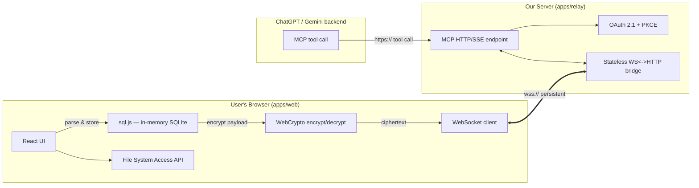

# DashDraft - Technical Architecture Document

**Status:** Draft v1
**Scope:** Tech stack, architecture, and coding standards. Functional requirements (FRD) to follow separately.

---

## 1. Purpose

Define the technical foundation for a tool that lets a user:

1. Upload a CSV in-browser and convert it to a queryable SQL table client-side.
2. Expose that table as an MCP (Model Context Protocol) tool that ChatGPT / Gemini can call.
3. Answer natural-language questions against the data **without** the raw dataset ever leaving the user's machine or being sent as LLM context — only schema and query results cross the wire, keeping token usage low.
4. Route MCP traffic through a relay server that we control, but which never sees plaintext data (transit encryption, zero payload retention).

This document defines *how* we build it, not *what* it does feature-by-feature — that's the FRD.

---

## 2. System Overview



Key architectural decision: the relay is a **dumb, stateless pipe**. It terminates TLS, authenticates the AI platform via OAuth, and forwards opaque bytes between an inbound HTTPS/SSE request and an outbound WebSocket session held by the browser. It never decrypts payloads and never persists them (see §5.4).

---

## 3. Tech Stack

| Layer | Choice | Notes |
|---|---|---|
| Frontend framework | React 18 + Vite | Fast dev server, native ESM, no framework lock-in |
| Frontend language | TypeScript (strict) | Required across the entire repo, no exceptions |
| Routing / URL state | React Router v7 (data mode) + `nuqs` | See §5.1 for rationale |
| In-browser SQL | `sql.js` (SQLite via WASM) | Optionally `absurd-sql` if we need IndexedDB persistence later |
| CSV parsing | `papaparse` | Streaming parse for large files |
| Local file access | File System Access API | Chromium-only; documented fallback for other browsers |
| Client-side crypto | WebCrypto API (AES-GCM + ECDH key exchange) | No custom crypto — browser-native primitives only |
| Backend framework | Express (Node.js 20 LTS) + TypeScript | Per requirement |
| WebSocket bridge | `ws` (mounted on the same HTTP server as Express) | Express has no native WS support; `ws` attaches to the same `http.Server` instance |
| MCP protocol | `@modelcontextprotocol/sdk` | Official SDK for server-side MCP + Streamable HTTP/SSE transport |
| Schema validation | `zod` | Shared between frontend and relay via a shared package — single source of truth for message shapes |
| Monorepo tooling | `pnpm` workspaces + Turborepo | See §4 |
| Testing (unit) | Vitest | Shared config across all packages |
| Testing (component) | React Testing Library | |
| Testing (e2e) | Playwright | Covers upload → query → result flow |
| Testing (API) | Supertest | Relay endpoint contract tests |
| Lint / format | ESLint (flat config) + Prettier | Shared root config, no per-package overrides without justification |
| CI/CD | GitHub Actions | Lint → typecheck → test → build, gated on all four |

**Explicitly rejected for now:** Next.js (no server-rendering need, adds complexity we don't need for a client-heavy app), NestJS (Express is sufficient and lighter for a thin relay), Fastify (Express specified by requirement).

---

## 4. Monorepo Structure

```
repo/
├── apps/
│   ├── web/                      # React frontend
│   │   ├── src/
│   │   │   ├── features/         # feature-sliced: upload/, query/, connect/
│   │   │   ├── lib/              # sql.js wrapper, crypto wrapper, fs-access wrapper
│   │   │   ├── routes/           # React Router route modules
│   │   │   ├── state/            # URL state hooks (nuqs-based)
│   │   │   └── main.tsx
│   │   ├── vite.config.ts
│   │   └── package.json
│   │
│   └── relay/                    # Express relay server
│       ├── src/
│       │   ├── mcp/              # MCP endpoint, tool registration
│       │   ├── auth/             # OAuth 2.1 + PKCE flows
│       │   ├── bridge/           # WS<->HTTP session bridge (stateless)
│       │   ├── middleware/
│       │   └── server.ts
│       └── package.json
│
├── packages/
│   ├── shared-types/              # Zod schemas + inferred TS types, used by both apps
│   ├── mcp-contracts/             # MCP tool/message schemas specifically
│   └── config/                    # Shared eslint/tsconfig/prettier bases
│
├── turbo.json
├── pnpm-workspace.yaml
├── tsconfig.base.json
└── package.json
```

**Rule:** No app imports another app's source directly. Cross-cutting types/logic live in `packages/` and are imported as workspace dependencies (`@repo/shared-types`, etc.). This keeps `apps/web` and `apps/relay` independently deployable.

---

## 5. Architecture Details

### 5.1 Frontend App (`apps/web`)

**URL state management.** App state that should survive a refresh or be shareable/bookmarkable (active table name, current query, connector status view, active tab) lives in the URL via `nuqs`, layered on top of React Router v7's data APIs for route-level loading. Rationale:

- `nuqs` gives type-safe, validated (zod-backed) search-param state with minimal boilerplate, avoiding the common footgun of manually parsing/serializing `URLSearchParams`.
- Keeping UI state in the URL (rather than only in React state or a global store) means a user can refresh mid-session without losing their place, and makes debugging/support easier (a URL fully describes what the user was looking at).
- **What does *not* go in the URL:** anything sensitive — no encryption keys, no OAuth tokens, no raw data. URL state is for navigation/view state only.

**Data flow inside the browser:**
1. `papaparse` streams the CSV into memory.
2. `sql.js` creates an in-memory SQLite table from the parsed rows.
3. If the user selected a local folder, the resulting `.sqlite` file is written back via the File System Access API (`showDirectoryPicker` + `FileSystemWritableFileStream`).
4. On a tool call, only the **schema** (and, for the response leg, query results) is passed to `lib/crypto` for encryption before hitting the WebSocket client — raw table contents never serialize onto the wire wholesale.

**Browser support:** File System Access API is Chromium-only. The UI must feature-detect (`'showDirectoryPicker' in window`) and degrade to a download-based flow (export `.sqlite` file, let the user save manually) rather than silently failing.

### 5.2 Relay Server (`apps/relay`)

Responsibilities, deliberately minimal:

1. **MCP endpoint** — implements Streamable HTTP/SSE transport (via `@modelcontextprotocol/sdk`) so ChatGPT/Gemini can call it as a standard remote MCP server.
2. **OAuth 2.1 + PKCE** — authenticates the *AI platform's request*, not the payload. This is the access-control layer; encryption (below) is the confidentiality layer. They're independent and both required.
3. **Bridge** — on receiving a validated MCP tool call, looks up the requesting user's live WebSocket session (keyed by an opaque session ID issued at connect time, never by anything derived from the data itself) and forwards the ciphertext payload down; streams the browser's ciphertext response back up as the tool result.

The relay holds **no table data, no query history, no decrypted content** at any point — see §5.4 for the enforcement mechanism, not just the intent.

### 5.3 Shared Contracts

`packages/mcp-contracts` defines every message shape (tool call request, tool result, error envelope, session handshake) as a `zod` schema once. Both `apps/web` and `apps/relay` import the same schema and derive their TypeScript types from it (`z.infer<...>`), so a shape change in one place can't silently desync the other side — a build-time type error, not a runtime surprise.

### 5.4 Security Architecture

| Concern | Mechanism |
|---|---|
| Transit encryption (network layer) | `wss://` (browser↔relay), `https://` (relay↔AI platform) — TLS everywhere, no exceptions |
| Payload confidentiality (application layer) | AES-GCM encryption of tool-call payloads in the browser via WebCrypto before they enter the WebSocket; relay forwards ciphertext only and never holds the key |
| Access control | OAuth 2.1 + PKCE on the MCP endpoint, per the MCP authorization spec |
| Zero retention | Relay is stateless by design: no request/response body logging, no database, no disk writes of payload data. Enforced via lint rule + code review checklist (§6.6), not just policy |
| Auditability | Relay source is small and open enough to be independently reviewed — a design constraint, not an afterthought |

**Explicit limitation to document publicly:** because the AI platform's backend must read plaintext to answer the user, this is "encrypted in transit with zero server-side retention," not strict end-to-end encryption in the two-party sense. Marketing copy and docs must reflect this distinction accurately (see prior discussion) — do not describe this as "E2E encrypted" without the confidential-computing enclave upgrade noted as a future option.

---

## 6. Coding Standards

### 6.1 TypeScript

- `strict: true` in every `tsconfig.json`, inherited from `tsconfig.base.json`. No package may opt out.
- `noUncheckedIndexedAccess: true` — array/object index access returns `T | undefined`, forcing explicit handling.
- No `any`. Use `unknown` + narrowing, or a proper generic. Enforced via `@typescript-eslint/no-explicit-any` as an error, not a warning.
- Prefer `type` for shapes derived from Zod schemas (`z.infer`), `interface` for hand-authored object contracts meant to be extended.
- No default exports for anything except React route/page components (Vite/React Router convention); everything else uses named exports for better refactor-safety and import clarity.

### 6.2 Naming

- Files: `kebab-case.ts` / `kebab-case.tsx`.
- React components: `PascalCase` matching filename minus extension.
- Hooks: `useCamelCase`, one hook per file where reasonably sized.
- Zod schemas: suffix with `Schema` (`ToolCallSchema`); inferred types drop the suffix (`ToolCall`).
- Env vars: `SCREAMING_SNAKE_CASE`, prefixed by app (`RELAY_OAUTH_CLIENT_ID`, `WEB_MCP_ENDPOINT_URL`).

### 6.3 File & Folder Conventions

- Feature-sliced structure in `apps/web/src/features/*`: each feature owns its components, hooks, and local state; cross-feature reuse goes through `lib/` or `packages/shared-types`.
- No file should mix "pure logic" and "React component" — extract logic (crypto, sql.js calls, schema conversion) into `lib/` functions that are unit-testable without rendering anything.
- Barrel files (`index.ts` re-exports) are allowed at the feature root only, not nested inside every subfolder — keeps import graphs traceable.

### 6.4 Git & Commit Standards

- Conventional Commits (`feat:`, `fix:`, `chore:`, `refactor:`, `test:`, `docs:`) — enables changelog generation and makes the security-sensitive commits (`feat(relay): ...`, `fix(crypto): ...`) easy to audit later.
- Branch naming: `type/short-description` (e.g. `feat/mcp-oauth-flow`).
- No direct commits to `main`. PRs require: lint pass, typecheck pass, test pass, one approving review. For anything touching `apps/relay/src/bridge` or `apps/web/src/lib/crypto`, require two reviewers given the security sensitivity.

### 6.5 Testing Standards

- Every function in `lib/crypto` and `apps/relay/src/bridge` requires unit tests before merge — these are the two places a bug becomes a confidentiality incident, not just a UX bug.
- Every MCP tool exposed by the relay needs a Supertest contract test asserting the response matches its `zod` schema.
- One Playwright e2e test covers the full happy path: upload CSV → convert → simulate a tool call → verify result — run in CI on every PR, not just on release branches.
- Target coverage is a guideline, not a gate: 80%+ on `lib/`, `bridge/`, `auth/`; UI components are tested for behavior, not for coverage percentage.

### 6.6 Error Handling & Logging Policy

- **Hard rule, enforced in code review:** the relay must never `console.log`, write to a file, or send to any logging/observability service anything derived from tool-call *payload contents*. Logging is restricted to: connection lifecycle events, error types/codes, timing metrics, and opaque session IDs — never the ciphertext, never (obviously) any decrypted content, since the relay shouldn't have any to begin with.
- All errors crossing the relay boundary use a shared `ErrorEnvelope` schema (`packages/mcp-contracts`) with a stable `code` field — never leak stack traces or internal paths to the AI platform or the browser.
- Frontend: user-facing errors are mapped from internal error codes to plain-language messages in one central place (`lib/errors.ts`), not inlined ad hoc across components.

### 6.7 API Contracts

- Any message crossing an app boundary (web↔relay, relay↔AI platform) is defined once in `packages/mcp-contracts` as a Zod schema and validated at the boundary (`schema.parse(...)`) — reject and return a typed error rather than trusting shape at runtime.
- Breaking a shared schema requires a version bump in the schema's own changelog comment and a corresponding update in both consuming apps within the same PR — never merge a one-sided schema change.

---

## 7. Environment & Configuration

- `.env.example` checked into each app; real `.env` files gitignored.
- Secrets (OAuth client secret, any signing keys) live only in the relay's environment, injected at deploy time — never in the frontend bundle, never in `packages/shared-types` defaults.
- Config validated at startup via a Zod schema (`env.ts` in each app) — the app should fail fast on boot with a clear error if a required var is missing, not fail confusingly at request time.

---

## 8. Deployment Architecture (high level — detail deferred to FRD/infra doc)

- `apps/web`: static build, deployable to any static host/CDN.
- `apps/relay`: containerized Node process behind a stable HTTPS domain (named tunnel or direct host — per earlier discussion, avoid ephemeral/anonymous tunnels for anything beyond local dev, since the MCP endpoint URL must stay stable for registered connectors).
- Turborepo pipeline (`turbo.json`) defines `build`, `lint`, `typecheck`, `test` tasks with proper `dependsOn` graph so `packages/*` build before the apps that consume them.

---

## 9. Open Items for the FRD

- Exact MCP tool surface (single "query" tool vs. multiple tools per table/dataset).
- Multi-file / multi-table handling and join support in generated SQL.
- Session lifecycle: what happens to a relay session when the browser tab closes mid-query.
- Rate limiting / abuse protection on the relay's public MCP endpoint.
- Confidential-computing enclave as a stretch goal for a stronger encryption claim.
